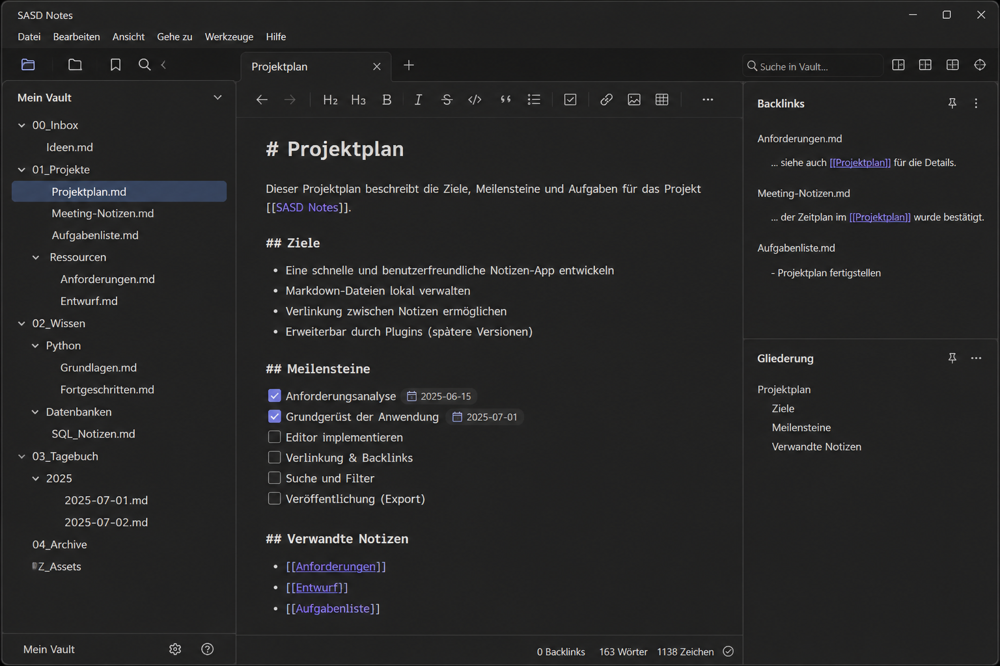

# SASD Notes

SASD Notes is a Windows desktop application for local Markdown knowledge bases. It is designed around plain `.md` files, wiki-style links, topic folders, search, backlinks and an editor-focused workflow.



## Current implementation status

This repository now contains a **working V1 code base structure** for a **.NET 8 WinForms** application with clean architectural layers:

- `Sasd.Notes.Domain`
- `Sasd.Notes.Application`
- `Sasd.Notes.Infrastructure`
- `Sasd.Notes.App.WinForms`
- `Sasd.Notes.Tests`

## Implemented V1 features

- Open a local vault folder
- Scan and load Markdown files recursively
- Show folders and notes in a TreeView
- Open and edit Markdown notes
- Save notes back to disk
- Create new notes in the selected folder
- Recent Folders menu
- Markdown editor toolbar
- Wiki-link parser (`[[Note]]`, `[[Folder/Note]]`, `[[Note|Alias]]`)
- Open selected wiki-links from the editor
- Search in note titles, paths and content
- Backlinks panel
- Outline panel from Markdown headings
- Info panel and status bar metrics
- Dirty-state handling with save prompt

## Build requirements

- Windows
- Visual Studio 2022
- .NET 8 SDK

## Build in Visual Studio

1. Open `Sasd.Notes.sln`
2. Restore and build the solution
3. Start `Sasd.Notes.App.WinForms`

## Build on the command line

```powershell
 dotnet restore
 dotnet build Sasd.Notes.sln
 dotnet run --project .\src\Sasd.Notes.App.WinForms\Sasd.Notes.App.WinForms.csproj
```

## Notes about the tests project

To keep the solution **package-free and easy to build**, `Sasd.Notes.Tests` is currently implemented as a small console-based verification harness instead of using external test packages. This keeps compilation simple and still provides executable checks for the core logic.

## Quick demo

A small `sample-vault/` is included so you can start the application and immediately open a realistic local knowledge base.

## Documentation

The `docs/` directory contains the project overview, requirements, technical design, security baseline, testing guide, user/developer documentation and the WinForms duty specification.
